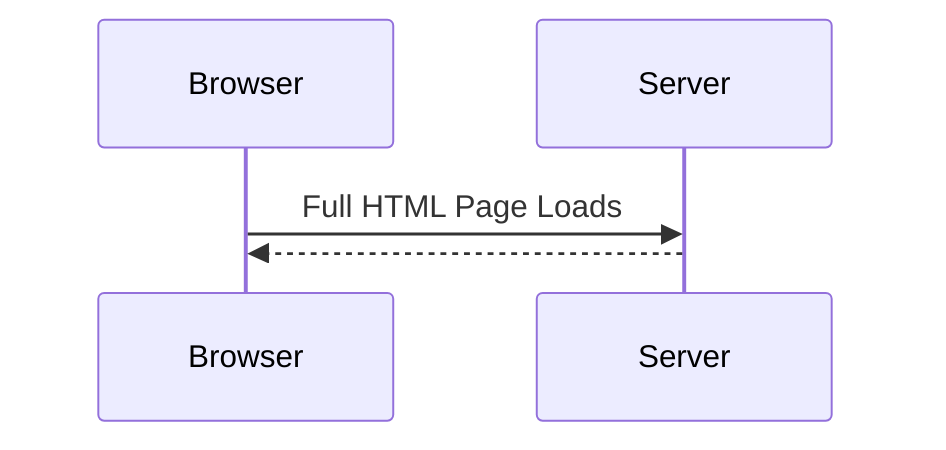
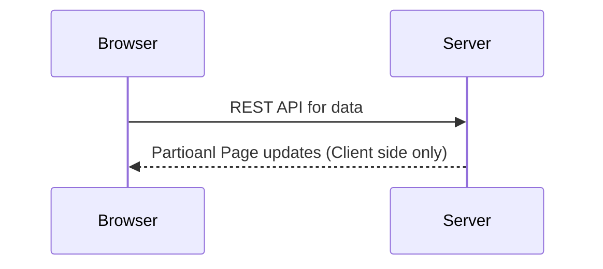

# typescript-crash-course
## What is Angular?
* Angular is a framework for building modern single-page application.
* **Official docs tutorials** - www.angular.io

### Traditional Application
* Each user action results in a full HTML page load.

### Single-Page Applicaton
* A web application that is composed of a single page
* Based on user actions, the application page is updated

### Example of Single-Page Applications
* Maps
* Email Applications
* Citi-Bank Customer Service
* Microsoft Xbox portal
* Refer to - www.madewithangular.com

## Setting up Development Tools
Tool | Purpose
-----|-------
node | For running JavaScript code from command-line
npm | Node Package Manage - Download new node packages and feature. Similar to maven
tsc | TypeScript compiler

## What is TypeScript?
* Language developed by Microsoft in 2012 - Free and Open source
* Provides static typing support to JavaScript. It has IDE Support: code completion and debugging
* Add Support for object-oriented programming - classes, objects, inheritance, interfaces etc
* TypeScript is a superset of JavaScript and ECMAScript
* Strongly-typed language with compile time checking and IDE support
* The Angular framework is internally developed using typescript
* Docs, online blogs and tutorials use TypeScript for coding examples
* For complete reference - www.typescriptlang.org

## TypeScript - Terminology
* First TypeScript Application - [Example](01-hellowworld/myhelloworld.ts)

* Defining Variables:
    * **Syntax** - let \<variableName\>: \<type\> = \<initial value\>;

Type | Description | Example
-----|------------|--------
boolean| true/false values | [Example](02-variables/variable-types.ts)
number | supports integer and floating point | [Example](02-variables/variable-types.ts)
string | text data. enclosed in single or double quotes | [Example](02-variables/variable-types.ts)
any | Supports "any" datatype assignment | [Example](02-variables/variable-types.ts)
others | See details at www.typescriptlang.org

* Loop and Arrays - [Example](03-loops-and-arrays)

* Access Modifiers

Modifier | Definition
---------|-----------
public | Property is accessible to all classes (default modifier)
protected | Property is only accessible in current and sub classes
private | Property is only accessible in current class

* Classes
    * Class Definition - [Example](04-classes/01-class-definition/customer.ts)
    * Access Modifiers - [Example](04-classes/02-access-modifiers/customer.ts)
    * Parameter Properties - [Example](04-classes/04-parameter-properties/customer.ts)

* tsconfig
    * Configuration file for TypeScript - [Example](04-classes/03-tsconfig/customer.ts)

* Module import and export
    * import - import {\<ClassName\>} from "\<Absolute Path of the file whereclass is defined\>" - [Example](04-classes/05-modules/driver.ts)
    * export - just add export before class name - [Example](04-classes/05-modules/customer.ts) 

 
